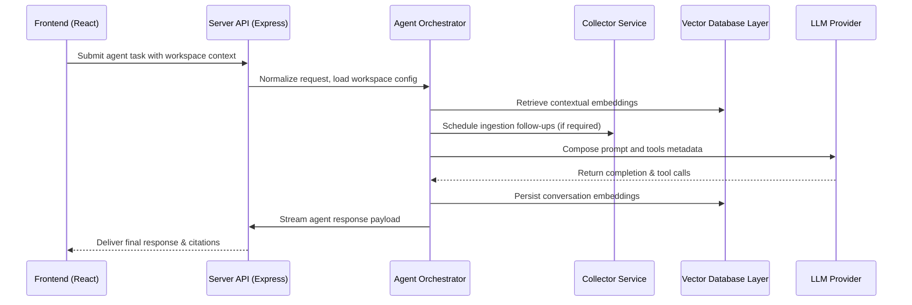

# Agent Orchestration Sequence

```mermaid
sequenceDiagram
    participant UI as Frontend (React)
    participant API as Server API (Express)
    participant Orchestrator as Agent Orchestrator
    participant Collector as Collector Service
    participant VectorDB as Vector Database Layer
    participant LLM as LLM Provider

    UI->>API: Submit agent task with workspace context
    API->>Orchestrator: Normalize request, load workspace config
    Orchestrator->>VectorDB: Retrieve contextual embeddings
    Orchestrator->>Collector: Schedule ingestion follow-ups (if required)
    Orchestrator->>LLM: Compose prompt and tools metadata
    LLM-->>Orchestrator: Return completion & tool calls
    Orchestrator->>VectorDB: Persist conversation embeddings
    Orchestrator->>API: Stream agent response payload
    API-->>UI: Deliver final response & citations
```
