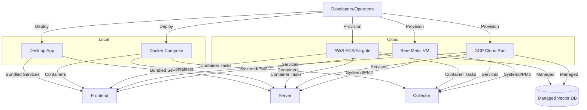

# Deployment Options

```mermaid
graph TD
    subgraph Local
        Desktop[Desktop App]
        Docker[Docker Compose]
    end

    subgraph Cloud
        AWS[AWS ECS/Fargate]
        GCP[GCP Cloud Run]
        BareMetal[Bare Metal VM]
    end

    Devs[Developers/Operators] -->|Deploy| Desktop
    Devs -->|Deploy| Docker
    Devs -->|Provision| AWS
    Devs -->|Provision| GCP
    Devs -->|Provision| BareMetal

    Desktop -->|Bundled Services| Frontend
    Desktop -->|Bundled Services| Server

    Docker -->|Containers| Frontend
    Docker -->|Containers| Server
    Docker -->|Containers| Collector

    AWS -->|Container Tasks| Frontend
    AWS -->|Container Tasks| Server
    AWS -->|Container Tasks| Collector
    AWS -->|Managed| VectorDB[(Managed Vector DB)]

    GCP -->|Services| Frontend
    GCP -->|Services| Server
    GCP -->|Services| Collector
    GCP -->|Managed| VectorDB

    BareMetal -->|Systemd/PM2| Frontend
    BareMetal -->|Systemd/PM2| Server
    BareMetal -->|Systemd/PM2| Collector
```
